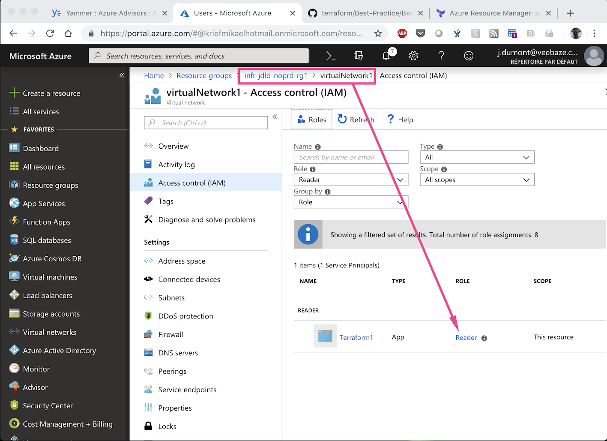
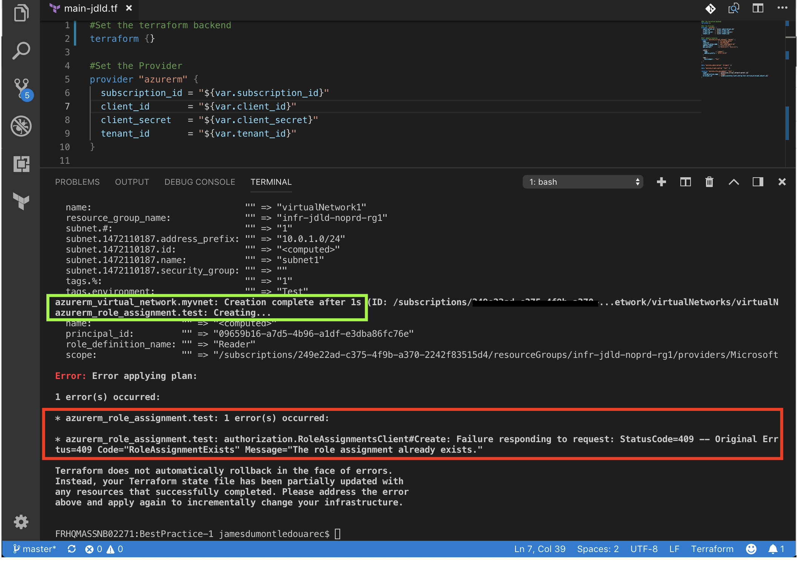

[Previous page >](../)

Best Practice 1
------------
Use remote backend.
In this article we will perform the following action with and without a remote backend : 
1. Create a Virtual Network
2. Assign a Role Definition to the Virtual Network

Through the second action we will be able to demonstrate one of the reason why we should use a remote backend : some resources like "azurerm_role_assignment" couldn't update their tfstate if the "role assignment" is already done. [This article on GitHub](https://github.com/terraform-providers/terraform-provider-azurerm/issues/1857) describes this topic.

In other words ... if you don't have the tfstate, your Terraform `apply` could fail and the only way to re adjust it would be : 
1. to find this tfstate back (would have been good to have it on a remote location) or 
2. to perform Terraform import on the the resources that you can't integrate back in your tfstate.


### Prerequisite
-----

| Item | Description |
| ------------- | ------------- |
| Azure Subscription | An Azure subscription id |
| Resource Group | An Azure resource group is available |
| Storage Account | An Azure storage account is available and is located in the upper resource group, it contains a container named `tfstate` |
| Service Principal | An Azure service principal is available and has the `owner` privilege on the upper resource group |
| Terraform file | [Clone this repository](https://github.com/JamesDLD/terraform/tree/master/Best-Practice/BestPractice-1) and fill in the following files with the upper prerequisite items : <br> Variable used for the Terraform `init` : secret/backend-jdld.json <br> Variable used for the Terraform `plan` and `apply` : [main.tf](main.tf) & secret/main-jdld.json |


What should we do?
------------
We will create the upper mentioned element using remote backend.

In the following article our remote backend will be located on an Azure Storage Account and we will use a service principal to write on this storage account.
To do so we will have to declare the following bracket in our Terraform tf file.
```hcl
terraform {
  backend "azurerm" {
    storage_account_name = "infrsand1vpcjdld1"
    container_name       = "tfstate"
    key                  = "BestPractice-1.tfstate"
    resource_group_name  = "infr-jdld-noprd-rg1"
    arm_subscription_id  = "xxxxxxx-xxxx-xxxx-xxxx-xxxxxxxxxxxx"
    arm_client_id        = "xxxxxxx-xxxx-xxxx-xxxx-xxxxxxxxxxxx"
    arm_client_secret    = "xxxxxxx-xxxx-xxxx-xxxx-xxxxxxxxxxxx"
    arm_tenant_id        = "xxxxxxx-xxxx-xxxx-xxxx-xxxxxxxxxxxx"
  }
}
```


### 1. Usage
-----

This step ensures that Terraform has all the prerequisites to build your template in Azure.
```hcl
terraform init -backend-config="secret/backend-jdld.json" -reconfigure
```

The terraform plan command is used to create an execution plan.
This step compares the requested resources to the state information saved by Terraform and then gives as an output the planned execution. Resources are not created in Azure.
```hcl
terraform plan -var-file="secret/main-jdld.json"
```

If all is ok with the proposal you can now apply the configuration.
```hcl
terraform apply -var-file="secret/main-jdld.json"
```

### 2. Analysis
-----

| Description | Screenshot |
| ------------- | ------------- |
| Our objects have been created on Azure |  |
| Our remote backend has generated a Terraform tfstate with all our objects specifications |  |


What shouldn't we do?
------------
We will now forget the backend specification. 
This will imply that we will no longer depend on a remote backend, in other words we will not be aware of any other deployment of someone else.

In here we will demonstrate that remote backend encourage collaboration.

Let's remove the following bracket : backend "azurerm" {}.
The top part of our [main.tf](main.tf) script will look like the following : 
```hcl
terraform {
}
```

### 1. Usage
-----

This step ensures that Terraform has all the prerequisites to build your template in Azure.
```hcl
terraform init -backend-config="secret/backend-jdld.json" -reconfigure
```
> When the message `Do you want to copy existing state to the new backend?` appears enter `no` and press enter.

You can now apply the configuration.
```hcl
terraform apply -var-file="secret/main-jdld.json"
```

### 2. Analysis
-----

| Description | Screenshot |
| ------------- | ------------- |
| Our objects are still on Azure  |  |
| The Terraform fails because for some resource like "azurerm_role_assignment" we can’t automatically <br> update our tfstate telling that the resource is already created as we wished. <br> Note that it wasn’t <br> the case for the resource "azurerm_virtual_network" |  |


See you!

JamesDLD