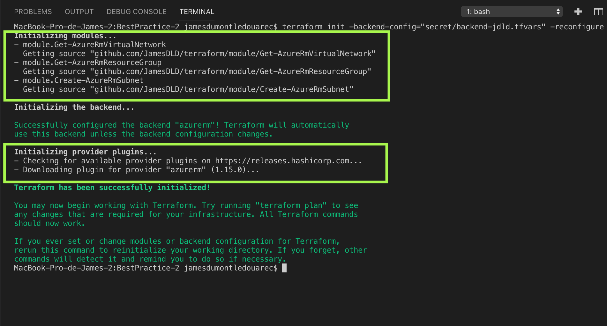
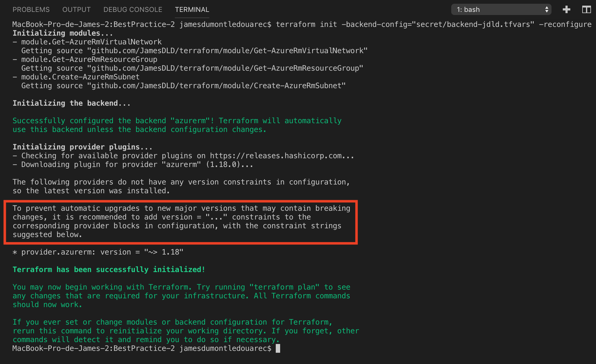

[Previous page >](../)

Best Practice 2
------------
In this article we will see how to set Terraform, provider and modules version (see [this article](https://www.terraform.io/docs/configuration/terraform.html) from terraform.io website to learn more about managing Terraform version).

In this article we will perform the following action  : 
1. Get a Virtual Network
2. Create a Subnet in this Virtual Network


### Prerequisite
-----

| Item | Description |
| ------------- | ------------- |
| Azure Subscription | An Azure subscription id |
| Resource Group | An Azure resource group is available |
| Storage Account | An Azure storage account is available and is located in the upper resource group, it contains a container named `tfstate` |
| Service Principal | An Azure service principal is available and has the `owner` privilege on the upper resource group |
| Terraform file | [Clone this repository](https://github.com/JamesDLD/terraform/tree/master/Best-Practice/BestPractice-2) and fill in the following files with the upper prerequisite items : <br> Variable used for the Terraform `init` : secret/backend-jdld.json <br> Variable used for the Terraform `plan` and `apply` : [main.tf](main.tf) & [main-jdld.tfvars](variable/main-jdld.tfvars) & secret/main-jdld.json |


What should we do?
------------
We will create the upper mentioned element using remote backend (see the previous article [BestPractice-1](../BestPractice-1) for more information about remote backend).

The Terraform executable file, the AzureRm provider and our modules version will be set as described in the following bracket (also available in our [main-jdld.tf](main-jdld.tf) Terraform file).


Declare Terraform required version 
```hcl
terraform {
  required_version = "0.12.3"

  backend "azurerm" {
    storage_account_name = "infrsand1vpcjdld1"
    container_name       = "tfstate"
    key                  = "BestPractice-2.tfstate"
    resource_group_name  = "infr-jdld-noprd-rg1"
  }
}
```

Specify the AzureRm version 
```hcl
provider "azurerm" {
  version         = "1.31.0"
  subscription_id = "${var.subscription_id}"
  client_id       = "${var.client_id}"
  client_secret   = "${var.client_secret}"
  tenant_id       = "${var.tenant_id}"
}
```

Specify the module version
```hcl
module "Get-AzureRmVirtualNetwork" {
  version                  = "~> 0.1"
  source                   = "github.com/JamesDLD/terraform/module/Get-AzureRmVirtualNetwork"
  vnets                    = "virtualNetwork1"
  vnet_resource_group_name = "infr-jdld-noprd-rg1"
}
```


### 1. Usage
-----

This step ensures that Terraform has all the prerequisites to build your template in Azure.
```hcl
terraform init -backend-config="secret/backend-jdld.json" -reconfigure
```

The terraform plan command is used to create an execution plan.
This step compares the requested resources to the state information saved by Terraform and then gives as an output the planned execution. Resources are not created in Azure.
```hcl
terraform plan -var-file="secret/main-jdld.json" -var-file="variable/main-jdld.tfvars"
```

If all is ok with the proposal you can now apply the configuration.
```hcl
terraform apply -var-file="secret/main-jdld.json" -var-file="variable/main-jdld.tfvars"
```

### 2. Analysis
-----

| Description | Screenshot |
| ------------- | ------------- |
| The Terraform `init` highlights our version |  |
| Check the Terraform init when you remove the version |  |


See you!

JamesDLD