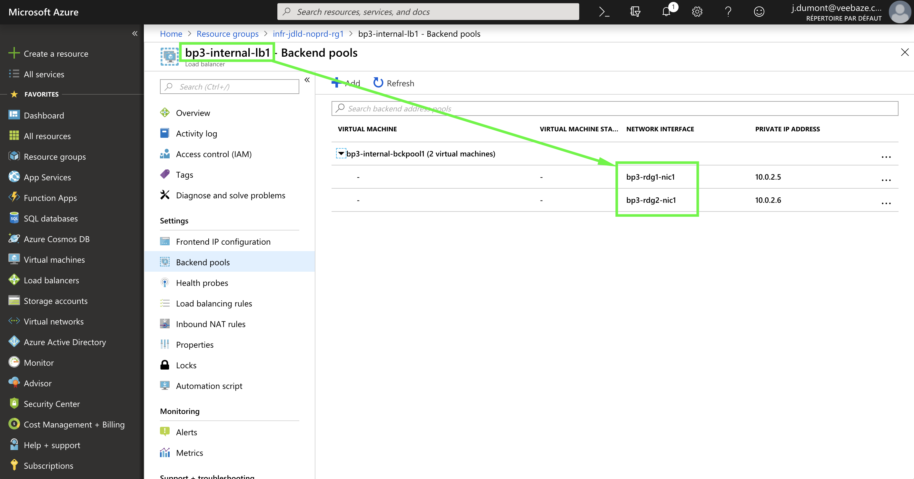
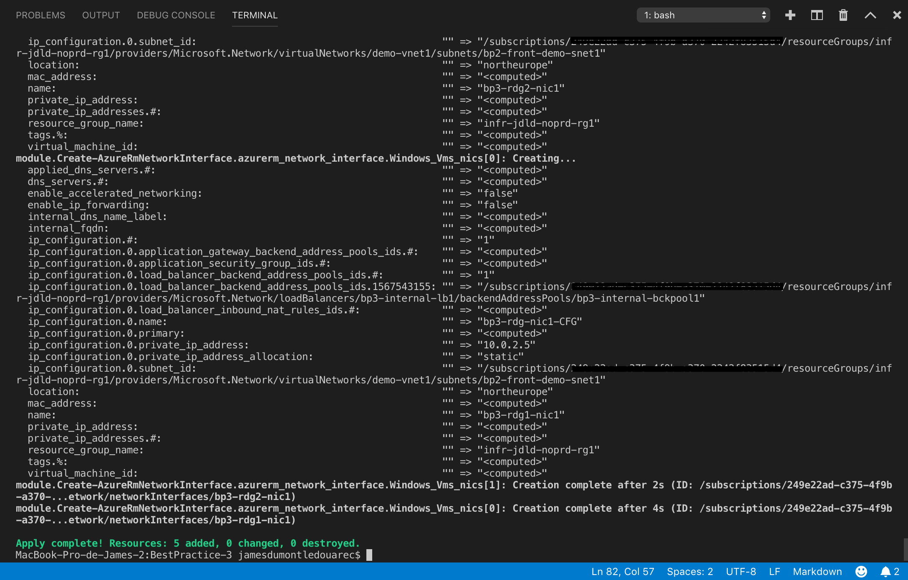
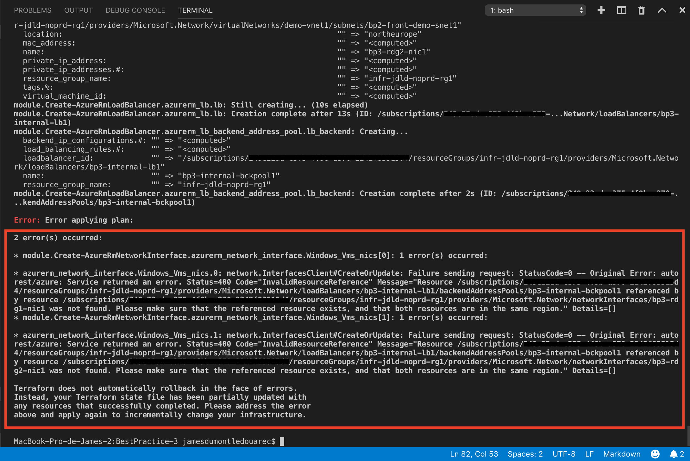

[Previous page >](../)

Best Practice 3
------------
Implicit dependencies should be used whenever possible (see [this article](https://www.terraform.io/intro/getting-started/dependencies.html) from terraform.io website for more information).
In this article we will perform the following action with *implicit* dependencies and with *explicit* dependencies : 
1. Create 1 load balancer
2. Create 2 network interfaces and link them to a load balancer


### Prerequisite
-----

| Item | Description |
| ------------- | ------------- |
| Azure Subscription | An Azure subscription id |
| Resource Group | An Azure resource group is available |
| Storage Account | An Azure storage account is available and is located in the upper resource group, it contains a container named `tfstate` |
| Service Principal | An Azure service principal is available and has the `owner` privilege on the upper resource group |
| Terraform file | [Clone this repository](https://github.com/JamesDLD/terraform/tree/master/Best-Practice/BestPractice-3) and fill in the following files with the upper prerequisite items : <br> Variable used for the Terraform `init` : secret/backend-jdld.tfvars <br> Variable used for the Terraform `plan` and `apply` : [main.tf](main.tf) & [main-jdld.tfvars](main-jdld.tfvars) & secret/main-jdld.tfvars |


What should we do?
------------
We will create the upper mentioned element using remote backend (see the previous article [BestPractice-1](../BestPractice-1) for more information about remote backend).

Review the code [main.tf](main.tf), as illustrated in the following bracket, the *implicit* and the *explicit* methods are highlighted.
```hcl
module "Create-AzureRmNetworkInterface" {
  version                 = "~> 0.1"
  source                  = "github.com/JamesDLD/terraform/module/Create-AzureRmNetworkInterface"
  Linux_Vms               = []                                                                    
  Windows_Vms             = ["${var.Windows_Vms}"]                                                
  nic_prefix              = "bp3-"
  nic_suffix              = "-nic1"
  nic_location            = "${module.Get-AzureRmResourceGroup.rg_location}"
  nic_resource_group_name = "${module.Get-AzureRmResourceGroup.rg_name}"
  subnets_ids             = "${module.Create-AzureRmSubnet.subnets_ids}"
  nic_tags                = "${module.Get-AzureRmResourceGroup.rg_tags}"
  nsgs_ids                = [""]

  #This an implicit dependency
  #lb_backend_ids = "${module.Create-AzureRmLoadBalancer.lb_backend_ids}"

  #This an explicit dependency                 
  lb_backend_ids = ["/subscriptions/${var.subscription_id}/resourceGroups/infr-jdld-noprd-rg1/providers/Microsoft.Network/loadBalancers/bp3-internal-lb1/backendAddressPools/bp3-internal-bckpool1"]
}
```


### 1. Usage
-----

This step ensures that Terraform has all the prerequisites to build your template in Azure.
```hcl
terraform init -backend-config="secret/backend-jdld.tfvars" -reconfigure
```

The Terraform plan command is used to create an execution plan.
This step compares the requested resources to the state information saved by Terraform and then gives as an output the planned execution. Resources are not created in Azure.
```hcl
terraform plan -var-file="secret/main-jdld.tfvars" -var-file="main-jdld.tfvars"
```

If all is ok with the proposal you can now apply the configuration with both methods (implicit and explicit) to track the impact.
```hcl
terraform apply -var-file="secret/main-jdld.tfvars" -var-file="main-jdld.tfvars"
```

We will now destroy what we have done with both methods (implicit and explicit) to track the impact.
```hcl
terraform destroy -var-file="secret/main-jdld.tfvars" -var-file="main-jdld.tfvars"
```

### 2. Analysis
-----

| Description | Screenshot |
| ------------- | ------------- |
| Our 2 network interfaces are linked to the Load Balancer |  |
| When using implicit dependencies all is working like a charm |  |
| When using explicit dependencies we receive error(s) because some resources doesn't wait for <br> other to be created (a workaround consists in using the variable `depend on` but this will still <br> cause error when you will proceed Terraform `destroy`) |  |


See you!

JamesDLD
