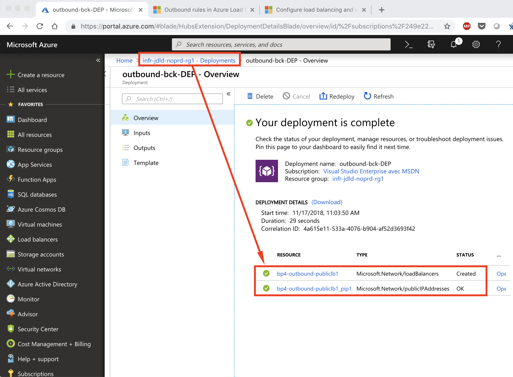
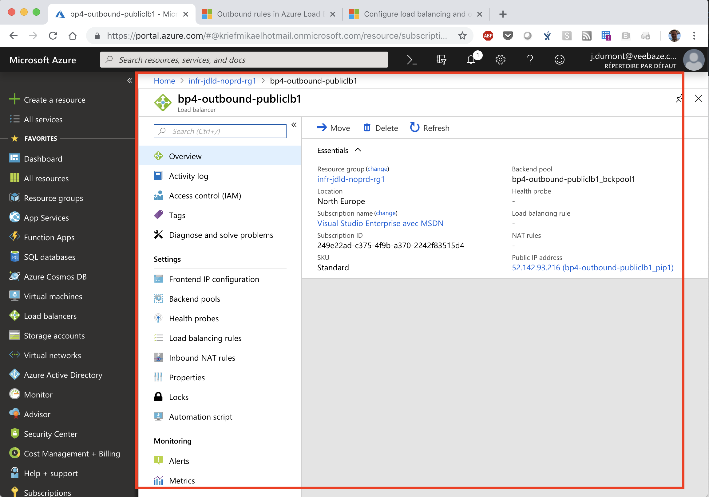

[Previous page >](../)

Best Practice 4
------------
These are my recommandations concerning the usage of the `azurerm_template_deployment` Terraform resource :
1. Don't use the `azurerm_template_deployment` Terraform resource
2. If you don't have the choice because one Terraform resource doesn't exist 
  * Create a feature request [here on GitHub](https://github.com/terraform-providers/terraform-provider-azurerm/issues/new/choose)
  * Use the `azurerm_template_deployment` Terraform resource (a demo will be shown in this article)
  
"Terraform can only manage the deployment of the ARM Template - and not any resources which are created by it. It's highly recommended using the Native Resources where possible instead rather than an ARM Template" (see [this article](https://www.terraform.io/docs/providers/azurerm/r/template_deployment.html) from terraform.io website for more information).

In this article we will perform the following action with : 
1. Create a Standard Public Load Balancer with outbound rules
  * Microsoft associated documentation : [Azure Load balancer outbound rules overview](https://docs.microsoft.com/en-us/azure/load-balancer/load-balancer-outbound-rules-overview)
  * Azure Rm Template : [azuredeploy.json](https://jamesdld.github.io/AzureRm-Template/Create-AzureRmLoadBalancerOutboundRules/)


### Prerequisite
-----

| Item | Description |
| ------------- | ------------- |
| Azure Subscription | An Azure subscription id |
| Resource Group | An Azure resource group is available |
| Storage Account | An Azure storage account is available and is located in the upper resource group, it contains a container named `tfstate` |
| Service Principal | An Azure service principal is available and has the `owner` privilege on the upper resource group |
| Terraform file | [Clone this repository](https://github.com/JamesDLD/terraform/tree/master/Best-Practice/BestPractice-4) and fill in the following files with the upper prerequisite items : <br> Variable used for the Terraform `init` : secret/backend-jdld.json <br> Variable used for the Terraform `plan` and `apply` : [main.tf](main.tf) & [main-jdld.tfvars](main-jdld.tfvars) & secret/main-jdld.json |


What should we do?
------------
We will create the upper mentioned element using remote backend (see the previous article [BestPractice-1](../BestPractice-1) for more information about remote backend).

Review the [main.tf file of the module here](https://github.com/JamesDLD/terraform/tree/master/module/Add-AzureRmLoadBalancerOutboundRules).
As illustrated in the following bracket that's how we can push parameters into an AzureRm template (this file template is located here : [azuredeploy.json](https://github.com/JamesDLD/AzureRm-Template/tree/master/Create-AzureRmLoadBalancerOutboundRules) 
```hcl
resource "azurerm_template_deployment" "lb_to_addOutboundRule" {
  name                = "${var.lbs_out[0]["suffix_name"]}-bck-DEP"
  resource_group_name = var.lb_out_resource_group_name
  template_body = file(
    "${path.module}/AzureRmLoadBalancerOutboundRules_template.json",
  )
  deployment_mode = "Incremental"

  parameters = {
    lbName                 = "${var.lb_out_prefix}${var.lbs_out[0]["suffix_name"]}${var.lb_out_suffix}"
    tags                   = jsonencode(var.lbs_tags)
    sku                    = var.lbs_out[0]["sku"]
    allocatedOutboundPorts = var.lbs_out[0]["allocatedOutboundPorts"]
    idleTimeoutInMinutes   = var.lbs_out[0]["idleTimeoutInMinutes"]
    enableTcpReset         = var.lbs_out[0]["enableTcpReset"]
    protocol               = var.lbs_out[0]["protocol"]
    lb_public_ip_id        = var.lb_public_ip_id
  }
}
```

### 1. Usage
-----

This step ensures that Terraform has all the prerequisites to build your template in Azure.
```hcl
terraform init -backend-config="secret/backend-jdld.json" -reconfigure
```

The Terraform plan command is used to create an execution plan.
This step compares the requested resources to the state information saved by Terraform and then gives as an output the planned execution. Resources are not created in Azure.
```hcl
terraform plan -var-file="secret/main-jdld.json" -var-file="main-jdld.tfvars"
```

If all is ok with the proposal you can now apply the configuration.
```hcl
terraform apply -var-file="secret/main-jdld.json" -var-file="main-jdld.tfvars"
```

We will now destroy what we have done and you will see that our load balancer will not be deleted.
```hcl
terraform destroy -var-file="secret/main-jdld.json" -var-file="main-jdld.tfvars"
```

### 2. Analysis
-----

| Description | Screenshot |
| ------------- | ------------- |
| Have a look on the deployment on Azure |  |
| When processing a Terraform `destroy` our deployment object is being deleted |  |
| After processing a Terraform `destroy` our load balancer is still available in Azure |  |


See you!

JamesDLD