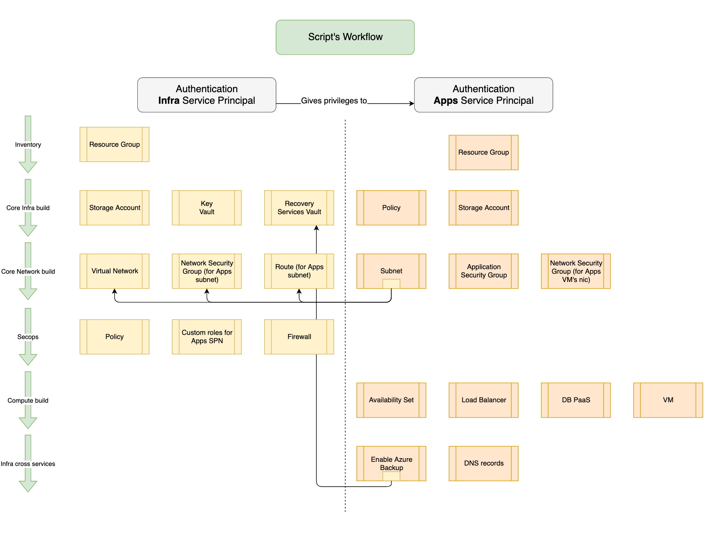

[Previous page >](../)

Azure and Terraform
------------
Simple and Powerful

HashiCorp Terraform enables you to safely and predictably create, change, and improve infrastructure. It is an open source tool that codifies APIs into declarative configuration files that can be shared amongst team members, treated as code, edited, reviewed, and versioned.

Objective
------------
Share Terraform custom modules with the community with the following guidelines :
-	a module is dedicated to one action : create network interfaces, create an Azure recovery vault, ...
-	a module doesn't contain any static values
-	a module is called using variables

Workflow
------------

Usage
-----

| Step  | Description |
| ------------- | ------------- |
| [1 - Infra](infra) | Deliver the Infra |
| [1 Bis - Infra vnet peering](infra_peering) | Virtual Network peering |
| [2 - Apps](apps)  | Deliver an Apps environment |

General Requirements
------------

-	[Terraform](https://www.Terraform.io/downloads.html) 0.11.13
-	[AzureRM Terraform Provider](https://github.com/Terraform-providers/Terraform-provider-azurerm/blob/master/README.md)
-	[AzureRM Terraform Provider - Authentication](https://www.Terraform.io/docs/providers/azurerm/)
-   The called "Infra" Azure Service Principal has the following privileges :
    - Owner privilege at Azure Subscription level (mandatory to create custom roles)
    - Read directory data on Windows Azure Active Directory (mandatory to assign custom roles)
-   The called "Apps" Azure Service Principal has the following privilege :
    - Reader privilege at Azure Subscription level (mandatory to use terraform data source ressource)

Golden rules
------------
-	 Always use Terraform implicit dependency, evict the use of the depends_on argument, [see Terraform dependencies article for more info](https://www.terraform.io/intro/getting-started/dependencies.html)
-	 Use remote backends to save your Terraform state, [see Terraform remote backends article for more info](https://www.terraform.io/intro/getting-started/remote.html)

Improvment & Feature request & Limitation
------------
-	Even with the use of implicit dependency, the script doesn't wait enough between the privileges setting for Apps SPN and the when Apps SPN creates it's objects, for this reason the script will raise a privilege error at the first time, you will have to relaunch it to have a full success of all operations. After this, the Apps SPN doesn't need anymore to have the Reader privilege at the subscription level. [This might me solved by with feature "timeout" explained here](https://github.com/terraform-providers/terraform-provider-azurerm/issues/2807).
-	Terraform authentication to AzureRM via Service Principal & certificate
-   Feature Request: resource azurerm_automation_variable, [ticket raised here](https://github.com/terraform-providers/terraform-provider-azurerm/issues/1312)
-	Couldn't find any option to set the BackupStorageRedundancy paremeter (LRS or GRS) in the RecoveryServices/vaults template, [Microsoft.RecoveryServices/vaults template reference](https://docs.microsoft.com/en-us/azure/templates/microsoft.recoveryservices/vaults)

Solved issues
------------
-   Use multiple Azure service principal through the provider AzureRm, [ticket raised here](https://github.com/terraform-providers/terraform-provider-azurerm/issues/1308)
    - Solution : usage of provider.azurerm v1.6.0
-   Use condition to decide wether or not a NIC should be linked to a Load Balancer, [ticket raised here](https://github.com/terraform-providers/terraform-provider-azurerm/issues/1318)
    - Solution : usage of function "compact" & bracket to send empty list
-	Terraform resource for AzureRm recovery services is now available, I still use the Terraform resource azurerm_template_deployment but you can use the native resource since provider.azurerm v1.4.0. [change log is available here for info](https://github.com/terraform-providers/terraform-provider-azurerm/blob/master/CHANGELOG.md)